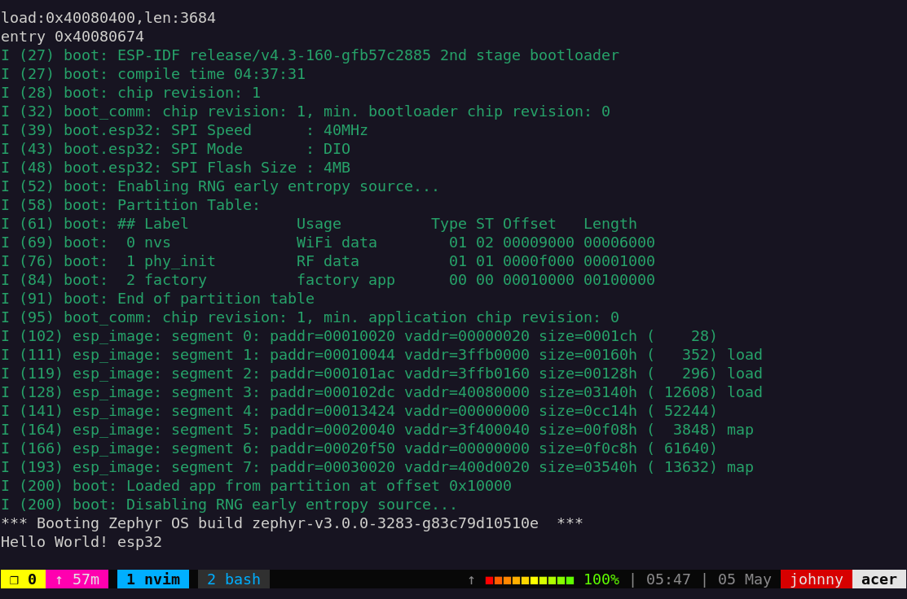

# Ejemplo HelloWorld esp32

## Instalación de herramientas

0. Lo primero que debe realizar es la instalación de Zephyr OS y el SDK o ToolChain de Zephyr OS. Para ello siga las instrucciones en la página oficial: [Instalación de Zephyr OS](https://docs.zephyrproject.org/latest/develop/getting_started/index.html)

Si no a instalado los submodulos de zephyr para espressif y además el toolchain de espressif,
deberá instalarlos en la siguiente secuencia:
Instaladas las herramientas descritas en el punto **0.** ahora se requiere instalar las herramientas
asociadas al **esp32** de zephyr, para ello desde esta terminal ejecute las instrucciones siguientes:

1. Exportación de variables de entorno para zephyr en la variante de espressif

```bash
. zephyr-env.sh esp
```

2. Instalación de toolchain espressif

```bash
make west-esp-tolchain-install
```

3. Instalación y actualización de submodulos de espressif en zephyr

```bash
make west-esp-update
```

4. Instala un monitor serial para poder hacer debug o ver resultados del proceso, se recomienda dos de ellos:

```bash
# comando de instalación
sudo apt install minicom picocom
```

5. Dar permisos al grupo *dialout* a su usuario linux, ejemplo de comando:

```bash
sudo usermod -a -G dialout user_name
```

**Observaciones**:

* En el anterior comando *user_name* debe ser reemplazado por su nombre de usuario, sino lo conoce puede ejecutar el comando `whoami` el cual le devolverá su nombre de usuario.

* Para que el anterior comando funcione deberá reiniciar el PC; después del reinicio, podrá verificar ejecutando el comando `groups`, allí deberá observar el grupo dialout, ejemplo:

  ```bash
  ~/projects  $  groups 
  johnny dialout cdrom floppy audio dip video plugdev netdev bluetooth lpadmin scanner
  ```


## Construcción y Flasheo

Ejecute los siguiente comando para construir el programa que correrá en el esp32:

```bash
make b
```

Con el esp32 conectado al PC proceda a programar la memoria flash del esp32 para
subir el programa con el siguiente comando:

```bash
make f
```

**Observación**: puede ejecutar la anterior secuencia de comandos en una sola instrucción como sigue: `make b f`

### Ver resultado por terminal

```bash
make t
```

En la placa de desarrollo oprima el botón de reiniciar y observe el resultado
en el monitor serial.

Ejemplo de resultado:

{ width=100%}

**Observaciones**:

* Observe que en los comandos se hace uso de *make* para ver que otros comandos fueron planteados ejecute el comando `make help`. Para aprender más sobre *make* se invita a revisar su documentación.
* Puede ejecutar `make b f t` si quiere realizar el proceso de construcción, flasheo y monitoreo por serial en un solo comando.

## Referencias

https://www.zephyrproject.org/zephyr-rtos-on-esp32/
